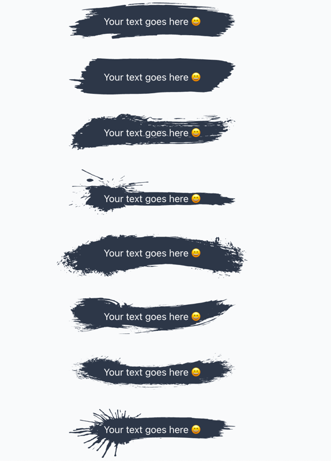

# react-brush-text

> Background for your text

[](https://www.npmjs.com/package/react-brush-text) [](https://standardjs.com)

## Install

```bash
npm install --save react-brush-text
```

## Example


#### 8 different types


```jsx
import React, { Component } from 'react'

import { Brush } from 'react-brush-text'

class Example extends Component {
  render() {
    return <Brush type={1} style={{ padding: "17px 58px"}} />
  }
}
```

## License

MIT © [aleksandar-b](https://github.com/aleksandar-b)
